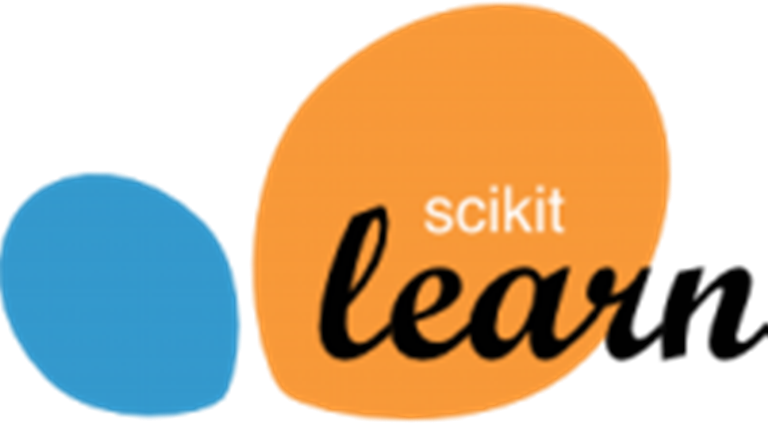

***
Repositories related to the scikit-learn Python machine learning library
***

# 
http://scikit-learn.org

---

### 
Scikit-learn is a free software machine learning library for the Python programming language.

It features various classification, regression and clustering algorithms including support vector machines, random forests, gradient boosting, k-means and DBSCAN, and is designed to interoperate with the Python numerical and scientific libraries NumPy and SciPy.

> ***Scikit-learn*** integrates well with many other ***Python libraries***, such as *matplotlib and plotly for plotting, numpy for array vectorization, pandas dataframes, scipy, and many more.*

---

# 
Overview

The ***scikit-learn project*** stems from the notion that it is a ***"SciKit"** (***SciPy Toolkit***), a separately-developed and distributed third-party extension to ***SciPy***. ***Scikit-learn*** is one of the most popular machine learning libraries on GitHub.

---

# 
Implementation

***Scikit-learn*** is largely written in Python, and <u>uses numpy extensively for high-performance linear algebra and array operations</u>. Furthermore, some core algorithms are written in ***Cython*** to improve performance. Support vector machines are implemented by a ***Cython wrapper*** around ***LIBSVM***; logistic regression and linear support vector machines by a similar wrapper around ***LIBLINEAR***. In such cases, extending these methods with Python may not be possible.

---
